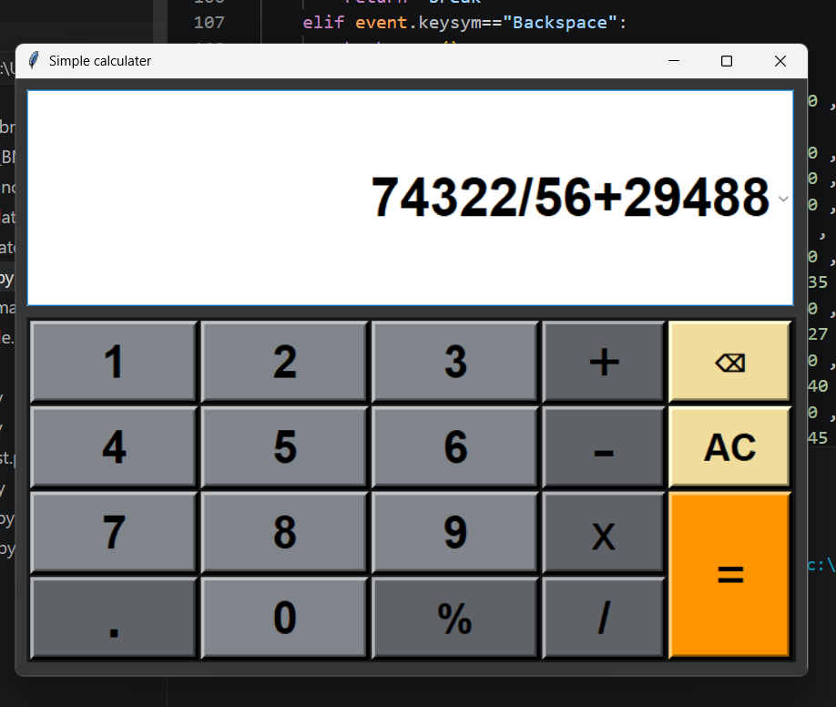

# Advanced Calculator

A desktop calculator application developed using Python and Tkinter.
The application provides a graphical user interface for performing arithmetic operations
while supporting keyboard input, calculation history management, automatic history storage, 
and dynamic display adjustments.

## Features

* Perform basic arithmetic operations

  * Addition
  * Subtraction
  * Multiplication
  * Division
  * Percentage calculations
* Keyboard input support
* Calculation history tracking
* History navigation using arrow keys
* Automatic history saving to a text file
* Dynamic font resizing for long expressions
* Backspace and clear functionality
* Error handling for invalid expressions

##Technologies Used

* Python 3
* Tkinter
* ttk

## Project Structure

``'
Calculator/
├── main.py
├── calculator_history.txt
├── calculator.png
├── calculator_dropdown_feature.png
└── README.md


## Usage

1. Launch the application.
2. Enter an expression using either the buttons or keyboard.
3. Press `=` or `Enter` to calculate the result.
4. Use the Up and Down arrow keys to browse previous calculations.
5. Use the Backspace button to remove characters.
6. Use the AC button to clear the display.


### Main Interface



## Data Persistence

Calculation history is automatically stored in a local text file named:

```text
calculator_history.txt
```

This allows users to maintain a record of previous calculations between sessions.

## Future Enhancements

* Scientific calculator functions
* Theme customization
* Memory operations
* Export history functionality
* Enhanced expression validation


