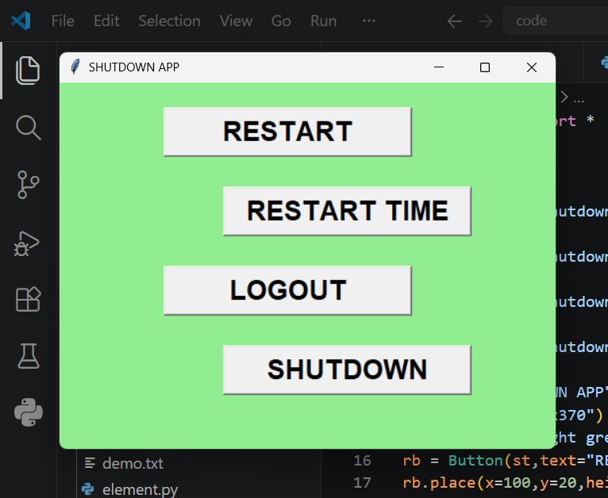

# SHUTDOWN APP

This desktop utility application developed using Python and Tkinter that provides quick access to common Windows system power management functions through a graphical user interface.

## Features

* Immediate system shutdown
* Immediate system restart
* Scheduled restart with delay
* User logout functionality
* Simple and lightweight graphical interface
* One-click system control operations

## Technologies Used

* Python 3
* Tkinter
* OS Module

## Project Structure

```text
SHUTDOWN_App/
├── main.py
├── screenshots.png
└── README.md
```

## Usage

1. Launch the application.
2. Select one of the available actions:

   * Restart
   * Restart with Delay
   * Logout
   * Shutdown
3. The selected operation will be executed immediately.

## Available Operations

| Operation    | Description                             |
| ------------ | --------------------------------------- |
| Restart      | Restarts the system immediately         |
| Restart Time | Restarts the system after a short delay |
| Logout       | Logs out the current user               |
| Shutdown     | Shuts down the system immediately       |

## Screenshots

### Main Interface



## Important Note

This application executes Windows system commands using Python's `os.system()` function. Administrative privileges may be required for certain operations depending on system configuration.

## Future Enhancements

* Shutdown timer customization
* Shutdown cancellation option
* Confirmation dialogs before execution
* Cross-platform support
* Improved user interface design
